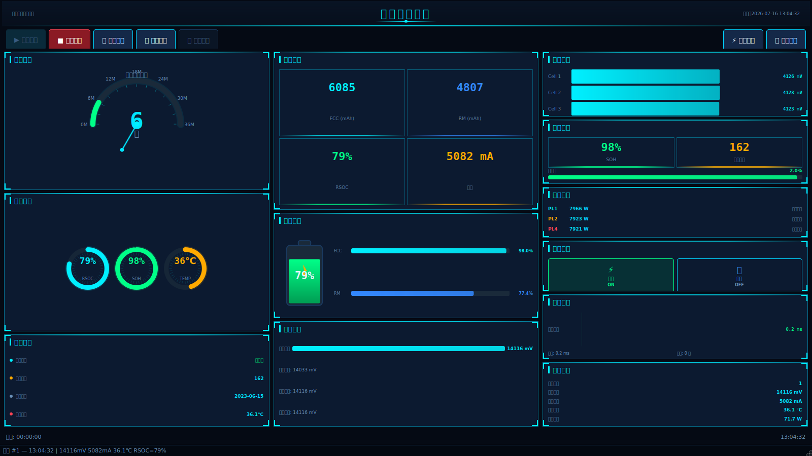
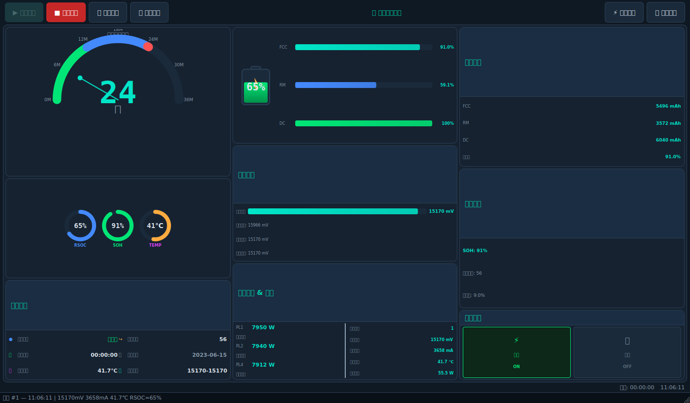
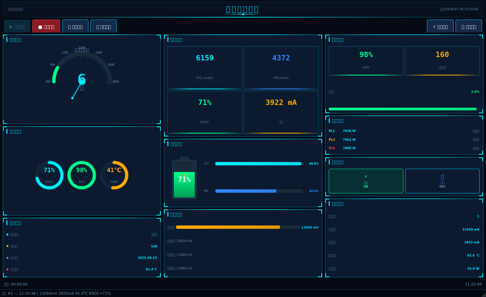

# Lenovo Battery Intelligent Platform (LBIP)

> **Lenovo 笔记本电池智能监控、诊断与预测平台**  
> 企业级 · 嵌入式上位机 · SMBus BMS 协议 · 实时数据可视化

[](https://www.python.org/)
[](https://doc.qt.io/qtforpython-6/)
[](#许可证)
[](#测试)
[](#测试)
[](#贡献指南)

---

## 目录

- [项目简介](#项目简介)
- [核心特性](#核心特性)
- [运行效果展示](#运行效果展示)
- [技术架构](#技术架构)
- [项目结构](#项目结构)
- [快速开始](#快速开始)
- [Docker 部署](#docker-部署)
- [Kubernetes 部署](#kubernetes-部署)
- [配置说明](#配置说明)
- [核心模块](#核心模块)
- [数据模型与协议](#数据模型与协议)
- [开发规范](#开发规范)
- [测试](#测试)
- [路线图](#路线图)
- [贡献指南](#贡献指南)
- [许可证](#许可证)

---

## 项目简介

**Lenovo Battery Intelligent Platform (LBIP)** 是 Sunwoda 集团面向 Lenovo 笔记本电池模组研发的**企业级嵌入式上位机平台**。系统基于 **SMBus / SBS (Smart Battery System) 协议** 与真实电池 BMS 通信，提供：

- 🔋 **实时监控**：电压、电流、温度、RSOC、SOH、循环次数
- 📊 **数据可视化**：13 面板科技风监控仪表盘（深空蓝 + 霓虹青）
- 🧠 **健康预测**：基于寄存器 0x6A 位域的电池寿命预测
- 🔌 **充电策略**：PL1/PL2/PL4 功率限制 + CV 恒压充电模式切换
- 🚨 **告警引擎**：10 条规则，去抖 + 恢复状态机
- 📈 **历史回溯**：SQLite 跨会话持久化 + 时序趋势对比
- 🔬 **通讯诊断**：延迟、错误率、连续成功/失败计数器
- 🧪 **Demo 模式**：无硬件环境下完整功能模拟

### 适用场景

| 场景 | 描述 |
|------|------|
| 产线下线测试 | 批量电池健康度自动检测 |
| 售后返修诊断 | 远程电池参数读取与故障定位 |
| 实验室研发 | 充电策略调优与寿命衰减建模 |
| 长期老化测试 | 跨会话 SQLite 时序数据采集 |

---

## 核心特性

### ✨ V3.0 监控面板（科技风大屏）

- **三栏布局**：左侧 6 面板（寿命/环量/状态）+ 中部 7 面板（KPI/电池/容量）+ 右侧 5 面板（健康/电芯/通讯）
- **装饰系统**：四角 L 形装饰 + 顶部辉光线条 + 渐变标题栏
- **KPI 卡片**：动画数值 + 底部渐变进度条
- **环量指示器**：外圈辉光 + 内圈刻度 + 单位标签
- **半圆仪表**：刻度线 + 指针辉光 + 中心辉光点
- **单元电压面板**：4 电芯柱状图 + Spread / Min / Max / Balance 网格
- **通讯诊断面板**：延迟条 + 2×2 指标网格（采样/错误率/连续成功/失败）

### 🔌 硬件通信

- 线程安全的 `SWD_EC.dll` / `Sunwoda.dll` 封装
- 多路径 DLL 搜索 + 完整性校验
- Demo 数据源（`DemoDLLInterface`）支持无硬件开发

### 📐 业务服务

- `DataAcquisitionService`：原子性读取所有寄存器
- `LifePredictionService`：基于 0x6A 位域的寿命评估
- `ChargeModeService`：CV 模式切换（寄存器 0x26/0x50）
- `LogDataService`：全量 SMBus 寄存器扫描
- `AlertEngine`：10 条告警规则 + 去抖 + 恢复
- `MetricsService`：通讯指标采集（延迟、错误率、连续成功/失败）
- `HistoryRepository`：SQLite 时序持久化（RLock 保护）

### 🛠 工程化

- **依赖倒置**：面向接口编程，支持数据源/视图模型无缝替换
- **可观测**：全链路日志、`traceId`、MetricsService 指标
- **配置驱动**：YAML + 热重载，零代码扩展
- **幂等一致**：防重复执行 + 事务保护
- **可测试**：216 单元测试 + 集成测试 + Demo Mock 沙箱

---

## 运行效果展示

### V3.0 主监控面板（1600×900）



> **深空蓝 + 霓虹青** 科技风大屏，三栏布局共 **18 个功能面板**，覆盖从硬件寄存器到业务指标的完整数据链路。

#### 面板分区说明

| 区域 | 面板 | 功能 |
|------|------|------|
| **顶部** | DecorativeTitleBar | 渐变线条 + 钻石装饰标题栏 |
| **顶部控制栏** | 连接状态 / 模式切换 / 历史 / 日志 | 全局控制入口 |
| **左栏** | 寿命预测半圆仪表 | 基于 0x6A 位域的 SOH 评估 |
| | 环量指示器 × 3 | 容量 / 能量 / 充放电功率 |
| | 状态行 × 3 | 电压 / 电流 / 温度 |
| | Battery Status Word | 16 位状态字展开 |
| **中栏** | KPI 卡片 × 3 | 电压 / 电流 / 温度快览 |
| | 电池图标 | 实时容量可视化 |
| | 容量条 × 2 | FullCharge / Remaining |
| | 电压详情 | 电压/电流/功率/温度分项 |
| **右栏** | Health 三联环 | SOH / Capacity / Resistance |
| | 单元电压面板 | 4 电芯柱状图 + Spread/Min/Max/Balance |
| | 功率限制 | PL1/PL2/PL4 |
| | 充电模式 | CC/CV + 电压电流阈值 |
| | 通讯诊断 | 延迟条 + 采样数/错误率/连续成功/失败 |

### 历史趋势窗口

历史趋势窗口（`history_trend_window.py`）支持跨会话 SQLite 数据回溯：
- 日期范围选择
- 指标下拉（电压/电流/温度/SOH/单元压差等）
- 会话 ID 过滤
- 旧数据清理

### 实时图表窗口（ChartWindow）

`4 × 3` 网格共 **10 条曲线**：电压 / 电流 / 温度 / RSOC / SOH / CycleCount / FCC / RM / CellSpread / FET_Temp。底部统计行展示当前会话采样数、错误数、平均延迟；支持 CSV 导出。

### 早期版本对比

| 版本 | 截图 | 说明 |
|------|------|------|
| V1.0 |  | 原始卡片式布局 |
| V2.0 |  | 中间过渡版 |
| **V3.0** |  | **当前版本** · 科技风大屏 |

---

## 技术架构

```
┌──────────────────────────────────────────────────────────────┐
│                       UI Layer (PySide6)                      │
│  MainWindow │ ChartWindow │ HistoryTrend │ LogWindow          │
└──────┬───────────────┬──────────────┬──────────────┬─────────┘
       │               │              │              │
       ▼               ▼              ▼              ▼
┌──────────┐   ┌──────────┐   ┌──────────┐   ┌──────────────┐
│DataWorker│   │HistoryWrk│   │ LogWorker│   │StateManager  │
│  (QThread)│   │ (QThread)│   │ (QThread)│   │  (Observer)  │
└──────┬───┘   └────┬─────┘   └────┬─────┘   └──────┬───────┘
       │            │              │                │
       ▼            ▼              ▼                ▼
┌──────────────────────────────────────────────────────────────┐
│                     Service Layer                             │
│  DataAcquisition │ LifePrediction │ ChargeMode │ AlertEngine │
│  MetricsService  │ HistoryRepository │ LogDataService          │
└──────┬────────────────────────────────────────────┬──────────┘
       │                                            │
       ▼                                            ▼
┌──────────────────┐                    ┌────────────────────┐
│ DLL Interface    │                    │   Persistence      │
│  (SWD_EC /       │                    │  (SQLite + YAML)   │
│   Sunwoda)       │                    │                    │
└──────────────────┘                    └────────────────────┘
```

### 关键设计原则

- **开闭原则**：新增功能不修改主流程（插件化）
- **依赖倒置**：UI/Service 依赖抽象接口，不依赖具体 DLL
- **单一职责**：每个 Service 仅负责一类业务
- **可观测**：所有 Worker 通过 `MetricsService` 上报指标
- **配置驱动**：YAML + 热重载，零代码扩展

---

## 项目结构

```
LenovoTool2_V1.0/
├── src/lenovo_tool/
│   ├── core/                       # 核心层
│   │   ├── data_models.py          # 不可变数据模型 (BatterySnapshot, CellVoltage, AlertEvent, CommMetrics)
│   │   ├── dll_interface.py        # DLL 硬件通信线程安全封装
│   │   ├── dll_loader.py           # DLL 路径解析与验证
│   │   ├── demo_datasource.py      # Demo 模式数据源
│   │   ├── exceptions.py           # 异常层次
│   │   ├── register_definitions.py # SMBus 寄存器目录
│   │   ├── unit_definitions.py     # 寄存器单位定义
│   │   └── interfaces.py           # 抽象接口
│   ├── services/                   # 业务服务层
│   │   ├── charge_mode.py          # 充电模式切换
│   │   ├── csv_export.py           # CSV 导出
│   │   ├── data_acquisition.py     # 实时数据采集
│   │   ├── life_prediction.py      # 电池寿命预测
│   │   ├── alert_engine.py         # 告警引擎（10 规则 + 去抖 + 恢复）
│   │   ├── metrics_service.py      # 通讯指标采集
│   │   ├── history_repository.py   # SQLite 时序持久化
│   │   ├── log_data_service.py     # 全寄存器日志扫描
│   │   └── state_manager.py        # 全局状态观察者
│   ├── ui/                         # PySide6 GUI
│   │   ├── main_window.py          # V3.0 主窗口（13 面板）
│   │   ├── chart_window.py         # 实时图表窗口（4×3 网格，10 曲线）
│   │   ├── history_trend_window.py # 历史趋势窗口
│   │   ├── log_window.py           # 全寄存器扫描窗口
│   │   ├── dialogs/                # 关于 / 错误对话框
│   │   ├── styles/                 # QSS 样式
│   │   ├── view_models/            # 视图模型
│   │   ├── widgets/                # 自定义控件（KPI / 环量 / 单元电压 / 通讯诊断 / 装饰面板等）
│   │   └── workers/                # 后台工作线程
│   ├── utils/                      # 工具模块
│   │   ├── byte_utils.py
│   │   ├── config_manager.py       # YAML 配置 + 热重载
│   │   ├── constants.py
│   │   └── logger_setup.py
│   └── main.py                     # 应用入口
├── tests/                          # 单元 + 集成测试（216 用例）
├── config/settings.yaml            # 主配置
├── docs/PRD_V3.0.md                # V3.0 产品需求文档
├── Dockerfile                      # Docker 镜像
├── docker-compose.yml              # Docker Compose
├── helm/                           # Helm Chart
├── k8s/                            # Kubernetes 部署
├── pyproject.toml                  # 项目配置与依赖
├── screenshot.png                  # V1.0 原始截图
├── screenshot_dashboard.png        # V2.0 过渡截图
└── screenshot_v3.png               # V3.0 当前截图（科技风大屏）
```

---

## 快速开始

### 环境要求

- **Python**: 3.12+
- **OS**: Windows 10/11 (硬件) / Linux/macOS (Demo 模式)
- **依赖管理**: `uv` (推荐) 或 `pip`

### 1. 克隆仓库

```bash
git clone https://github.com/xfengyin/LenovoTool2_V1.0.git
cd LenovoTool2_V1.0
```

### 2. 安装依赖

使用 `uv`（推荐）：

```bash
uv sync
```

或使用 `pip`：

```bash
pip install -e ".[dev]"
```

### 3. 运行应用

#### GUI 模式（真实硬件 · 仅 Windows）

```bash
python -m lenovo_tool.main
```

> 需要将 `SWD_EC.dll` / `Sunwoda.dll` 放入 `resources/dlls/` 目录。

#### Demo 模式（推荐 · 跨平台）

```bash
python -m lenovo_tool.main --demo
```

Demo 模式会：
- 加载 `DemoDLLInterface` 模拟所有寄存器
- 模拟 4 电芯电池 + FET 温度
- 注入随机告警事件（可关闭）
- 生成完整 V3.0 监控画面

#### 命令行模式（脚本化）

```bash
python -m lenovo_tool.main --headless --duration 60 --output ./logs
```

### 4. 截图预览

```bash
python _screenshot_v3.py
```

输出 `screenshot_v3.png`（1600×900 监控画面）。

---

## Docker 部署

```bash
# 构建镜像
docker build -t lenovo-battery-tool:3.0 .

# 运行 Demo 模式
docker run -it --rm \
  -e DISPLAY=$DISPLAY \
  -v /tmp/.X11-unix:/tmp/.X11-unix \
  lenovo-battery-tool:3.0 --demo
```

或使用 docker-compose：

```bash
docker-compose up -d
```

---

## Kubernetes 部署

Helm Chart 与原生 K8s manifests 已就绪：

```bash
# Helm
helm install lbip ./helm -n lbip --create-namespace

# kubectl
kubectl apply -f k8s/
```

详细配置见 `helm/values.yaml`。

---

## 配置说明

主配置文件：`config/settings.yaml`

```yaml
# 采集策略
polling:
  interval_ms: 1000        # 主轮询间隔
  log_scan_interval_ms: 5000  # 日志扫描间隔

# 仪表盘面板标题
gauge:
  title: "电池寿命预测"

# 历史数据持久化
history:
  enabled: true
  db_path: "./data/history.db"
  retention_days: 30
  batch_size: 100
  flush_interval_ms: 2000

# CSV 导出
csv:
  output_dir: "./exports"
  include_timestamp: true
```

> 支持热重载：修改配置后无需重启应用，下次采集周期生效。

---

## 核心模块

### 1. 硬件通信层

| 类 | 职责 |
|----|------|
| `DLLInterface` | 线程安全的 SWD_EC.dll / Sunwoda.dll 封装 |
| `DLLLoader` | DLL 路径解析 + 完整性校验 |
| `DemoDLLInterface` | 无硬件环境下的模拟数据接口 |

### 2. 业务服务层

| 服务 | 职责 |
|------|------|
| `DataAcquisitionService` | 原子性读取所有电池寄存器 |
| `LifePredictionService` | 基于 0x6A 位域的寿命评估 |
| `ChargeModeService` | CC/CV 充电模式切换 |
| `LogDataService` | 全量 SMBus 寄存器扫描 |
| `AlertEngine` | 10 条告警规则 + 去抖 + 恢复 |
| `MetricsService` | 通讯指标采集 |
| `HistoryRepository` | SQLite 时序持久化 |

### 3. GUI 控件（V3.0 新增）

| 控件 | 效果 |
|------|------|
| `PanelWidget` | 四角 L 装饰 + 顶部辉光线条 |
| `KpiCard` | 动画数值 + 底部渐变进度条 |
| `DecorativeTitleBar` | 渐变线条 + 钻石装饰标题栏 |
| `CellVoltagePanel` | 4 电芯柱状图 + Spread/Balance |
| `CommDiagnosticsPanel` | 延迟条 + 2×2 指标网格 |
| `RingIndicator` | 外圈辉光 + 内圈刻度 |
| `HalfGaugeWidget` | 刻度线 + 指针辉光 + 中心辉光点 |

---

## 数据模型与协议

### SMBus 寄存器映射

| 寄存器 | 名称 | 单位 | 说明 |
|--------|------|------|------|
| 0x09 | Voltage | mV | 电池包电压 |
| 0x0A | Current | mA | 充放电电流 |
| 0x0B | AverageCurrent | mA | 平均电流 |
| 0x0C | RelativeStateOfCharge | % | 相对容量 |
| 0x0D | AbsoluteStateOfCharge | % | 绝对容量 |
| 0x0E | RemainingCapacity | mAh | 剩余容量 |
| 0x0F | FullChargeCapacity | mAh | 满充容量 |
| 0x10 | RunTimeToEmpty | min | 剩余时间 |
| 0x13 | AverageTimeToEmpty | min | 平均剩余时间 |
| 0x17 | CycleCount | count | 循环次数 |
| 0x1A | RelativeStateOfHealth | % | 健康度 |
| 0x1E | Temperature | 0.1K | 电池温度 |
| 0x23 | CellVoltage | mV | 单元电压（块读） |
| 0x26 | ChargingVoltage | mV | 充电电压 |
| 0x28 | ChargingCurrent | mA | 充电电流 |
| 0x30 | FETTemperature | 0.1K | 充放电 MOS 温度 |
| 0x50 | ChargingMode | bit | CV 充电模式使能 |
| 0x6A | LifePrediction | bitfield | 寿命预测位域 |

### 核心数据类

```python
@dataclass(frozen=True, slots=True)
class BatterySnapshot:
    voltage_mv: int
    current_ma: int
    temperature_k: int
    rsoc: int
    soh: int
    cycle_count: int
    fcc_mah: int
    rm_mah: int
    cell_voltages: list[CellVoltage]
    fet_temperature: int | None = None
    timestamp: float = field(default_factory=time.time)
```

更多模型见 `src/lenovo_tool/core/data_models.py`。

---

## 开发规范

### 代码风格

- **PEP 8** 严格合规
- **类型提示**：所有公共 API 必须带完整类型注解
- **格式化**：`black` + `isort`
- **静态检查**：`ruff` + `mypy --strict`
- **文档字符串**：Google 风格

### 提交规范

遵循 [Conventional Commits](https://www.conventionalcommits.org/)：

```
feat(scope): 新功能
fix(scope):  修复
refactor(scope): 重构
docs(scope): 文档
test(scope): 测试
chore(scope): 杂项
```

---

## 测试

### 运行测试

```bash
# 全部测试
pytest tests/ -v

# 覆盖率
pytest tests/ --cov=lenovo_tool --cov-report=term-missing

# 仅单元测试
pytest tests/services tests/core -v

# 仅 UI 测试
pytest tests/ui -v
```

### 当前测试规模

| 模块 | 用例数 | 状态 |
|------|--------|------|
| `core` | ~50 | ✅ |
| `services` | ~100 | ✅ |
| `ui` | ~20 | ✅ |
| `integration` | ~10 | ✅ |
| `utils` | ~36 | ✅ |
| **合计** | **216** | **✅ 全部通过** |

### 覆盖率目标

- 总体覆盖率：**≥ 80%**
- 关键路径（`DataWorker` / `AlertEngine` / `HistoryRepository`）：**≥ 90%**

---

## 路线图

- [x] V1.0：基础卡片式 GUI + DLL 通信
- [x] V2.0：图表优化 + 视图模型
- [x] **V3.0**：科技风大屏 + 单元电压 + 通讯诊断 + 告警引擎 + SQLite 历史
- [ ] V4.0（规划）：多电池并联监控 + Web 远程面板
- [ ] V5.0（规划）：AI 寿命预测模型集成

---

## 贡献指南

1. Fork 仓库
2. 创建特性分支：`git checkout -b feature/awesome-feature`
3. 提交改动：`git commit -m "feat: add awesome feature"`
4. 推送分支：`git push origin feature/awesome-feature`
5. 提交 Pull Request

> PR 前请确保 `pytest` 与 `ruff check` 全部通过。

---

## 许可证

**Internal Use Only** — Sunwoda 集团内部工具，仅供内部使用。

```
Copyright (c) 2026 Sunwoda Electronic Co., Ltd.
All rights reserved.
```

---

## 联系方式

- **项目维护**：xfengyin
- **内部邮件**：[待补充]
- **问题反馈**：通过内部 Issue 系统提交

---

<p align="center">
  <sub>Built with ❤️ by Sunwoda Embedded Tools Team</sub>
</p>
